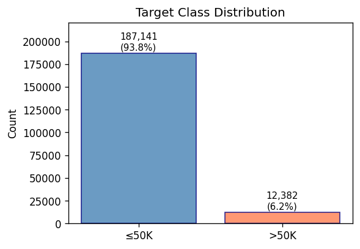
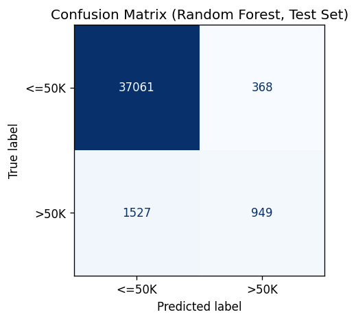
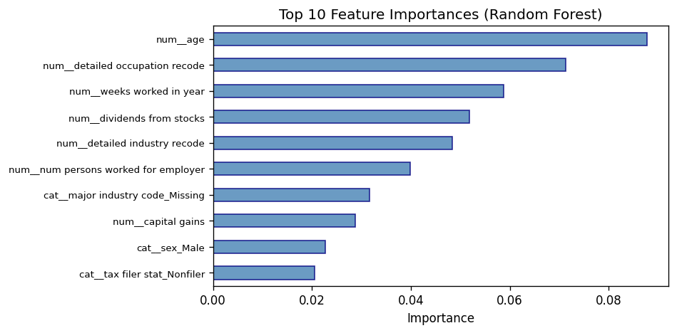
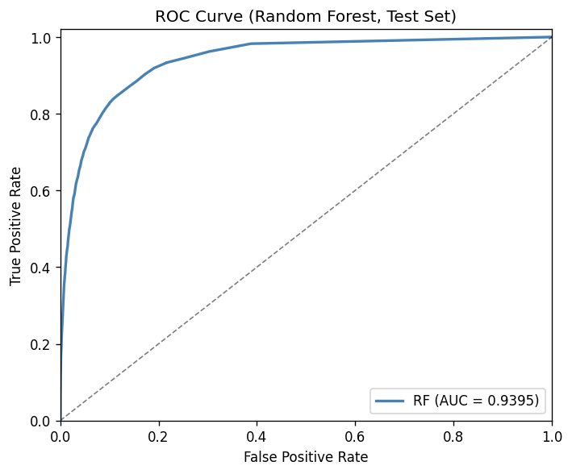
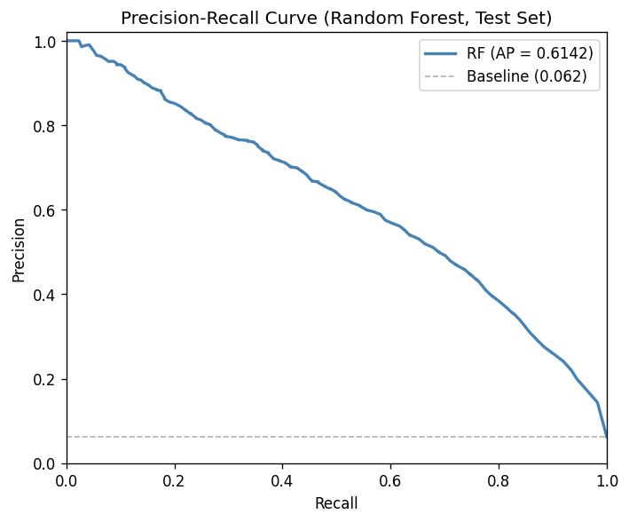
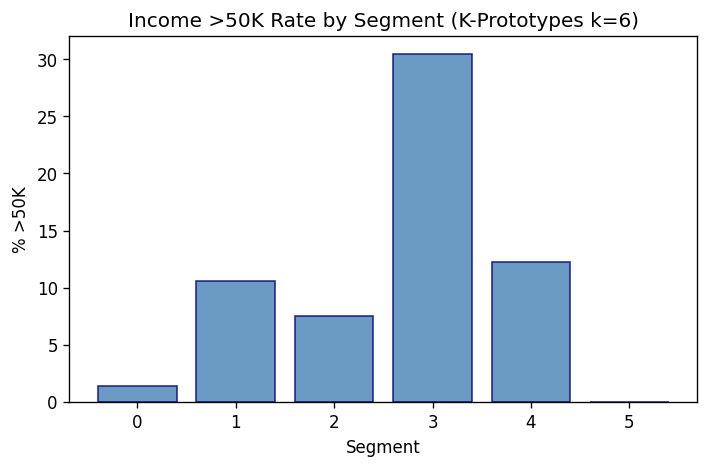

# Census Income Classification and Population Segmentation

**Preetham Dandu**  
**Take-Home Project — CCB Risk**

---

## 1. Introduction and Objectives

The project has two goals: (1) build a classifier to predict whether a person earns more or less than $50K, and (2) create a segmentation model to group the population for marketing. I picked methods that are interpretable and useful for decisions, not just high on metrics. All code, including scripts for K-Means, PCA+K-Means, and K-Prototypes comparisons, is in the accompanying repository [1].

**Data:** 1994–1995 U.S. Census Bureau Current Population Surveys [2]. Each record has 40 demographic/employment variables, a sampling weight, and an income label (≤50K or >50K). The data is comma-delimited with no header; column names come from a separate file.

---

## 2. Data Exploration and Pre-processing

### 2.1 What I Checked First

I started by loading the data and checking shape, target balance, and missing values.

A few things stood out:

- **Class imbalance:** About 6% of records are >50K. I knew I’d need to handle this in the classifier (e.g., class weights).
- **Missing values:** Some fields use "?", "Not in universe", or similar. I treated these as missing and handled them in the pipeline.
- **Mixed types:** Numeric (age, weeks worked, capital gains) and categorical (education, occupation, marital status). I kept both for the classifier; for segmentation I needed a method that can handle both without forcing categories into numbers.

### 2.2 Pre-processing Choices and Why

**Numeric columns:** Median imputation and StandardScaler. Capital gains and similar variables are heavily skewed—mean gets pulled by outliers, so median is more stable. Age (0–100) and weeks worked (0–52) have different ranges; scaling puts them on a similar scale so tree splits and distance-based methods behave sensibly.

**Categorical columns:** Constant imputation ("Missing") and one-hot encoding. Label encoding would treat education levels as ordered numbers, which is arbitrary. One-hot treats each category as its own binary flag. I used `handle_unknown="ignore"` so new categories at prediction time don't crash the pipeline.

**Excluded columns:** I dropped the weight and label from features. Weight is for population representation, not prediction. Label is the target.

**Train/test split:** 80/20 stratified on the label. With only ~6% >50K, a random split could give one set with 4% and another with 8%—uneven evaluation. Stratification keeps the same proportion in both. 80/20 is a standard trade-off: enough data to train, enough to evaluate. `random_state=42` for reproducibility.

---

## 3. Objective 1: Classification Model

### 3.1 What I Tried and How I Chose Random Forest

**Process:** I trained three classifiers—Logistic Regression (LR), Random Forest (RF), and XGBoost—on the same data, same preprocessing, same 80/20 split. I used 5-fold cross-validation with grid search to tune each (e.g., C for LR, n_estimators and max_depth for RF). Then I evaluated all three on the same holdout test set and compared metrics.

**How I decided which was best:** For marketing, the key question is: *when we predict >50K, how often are we right?* That's precision. I looked at the test-set metrics:

| Model | Precision (>50K) | Recall (>50K) | F1 | ROC-AUC |
|-------|------------------|---------------|-----|---------|
| LR | 0.2832 | 0.8982 | 0.4306 | 0.9463 |
| RF | **0.7206** | 0.3833 | **0.5004** | 0.9395 |
| XGBoost | 0.3340 | 0.8930 | 0.4861 | 0.9547 |

LR and XGBoost have high recall (they find most >50K) but low precision—when they say >50K, they're wrong 2 out of 3 times. That means wasted ad spend on misclassified low-income people. RF has the highest precision (0.7206) and best F1 (0.5004). When RF predicts >50K, it's right about 7 in 10 times.

I'll be honest—I expected XGBoost to win. It usually does on tabular data, and its ROC-AUC was the highest (0.9547). But ROC-AUC measures ranking, not the actual predictions you'd act on. When I checked what each model actually predicts at the default 0.5 threshold, XGBoost and LR were both flagging almost everyone as >50K. The balanced class weights amplify the minority class, which boosts recall but tanks precision. RF was different. I think the ensemble averaging softens the aggressive minority-class votes that individual trees make—fewer predictions total, but more of them right. That's what tipped the decision.

To put it concretely: if you mail 1,000 people the RF flags as >50K, about 720 actually are. With XGBoost that drops to ~330, with LR ~280. That's the difference between a profitable campaign and a wasteful one. I chose RF because precision matters more when you're spending money on ads—and it's still interpretable via feature importances.

### 3.2 Architecture and Training

- **Model:** Random Forest with `class_weight="balanced"`. With 94% ≤50K, the model would otherwise default to predicting ≤50K. Balanced weights upweight the rare >50K class so it learns both.
- **Tuning:** GridSearchCV over `n_estimators`, `max_depth`, `min_samples_leaf`, with 5-fold stratified CV. I tuned on ROC-AUC—it measures ranking quality (can we order people by >50K probability?) and handles imbalance well. Precision would be noisier for grid search.
- **Evaluation:** I held out 20% as test and never used it for training or tuning. Final metrics are on that test set only.

### 3.3 Results (Test Set)

| Metric | Value |
|--------|-------|
| Accuracy | 0.9525 |
| Precision (>50K) | 0.7206 |
| Recall (>50K) | 0.3833 |
| F1 (>50K) | 0.5004 |
| ROC-AUC | 0.9395 |

RF is conservative: it predicts >50K only when fairly confident. That means we miss some true >50K (recall 0.3833), but when we say >50K we’re usually right (precision 0.7206). For premium campaigns, that trade-off makes sense.

**Confusion matrix (test set):**

|  | Predicted ≤50K | Predicted >50K |
|--|----------------|----------------|
| **Actual ≤50K** | 37,061 | 368 |
| **Actual >50K** | 1,527 | 949 |

Most errors are false negatives (1,527 >50K people classified as ≤50K)—consistent with the conservative threshold. Only 368 false positives, which is why precision is high.

**Top drivers (feature importances):** age, detailed occupation recode, weeks worked in year, dividends from stocks, detailed industry recode. Occupation and work intensity predict income—makes sense.

**ROC and Precision-Recall curves:**

The ROC curve (AUC = 0.9395) shows strong ranking ability. The PR curve is more informative given the class imbalance—average precision is well above the ~6% baseline. Precision and recall at different thresholds:

| Threshold | Precision | Recall |
|-----------|-----------|--------|
| 0.30 | 0.5612 | 0.6167 |
| 0.40 | 0.6430 | 0.4976 |
| 0.50 (default) | 0.7206 | 0.3833 |
| 0.60 | 0.7818 | 0.2851 |
| 0.70 | 0.8558 | 0.1894 |
| 0.80 | 0.9248 | 0.1143 |

At the default 0.5 threshold, precision is ~72% and recall ~39%. Lowering to 0.3 catches 62% of >50K people but precision drops to 56%. Raising to 0.7 gives 86% precision but only finds 19% of >50K. The right threshold depends on the campaign budget vs. coverage goal.

### 3.4 How to Use It

Score new prospects with the same 40 variables. Apply the saved pipeline (preprocessing + model). Use the predicted class or probability to target high-confidence >50K for premium offers. Adjust the decision threshold based on the precision-recall trade-off above.

---

## 4. Objective 2: Segmentation Model

### 4.1 What I Tried and How I Chose K-Prototypes k=6

**Process:** I ran three methods—K-Means, PCA + K-Means, and K-Prototypes—at k=4, 5, and 6. I kept k in that range because a marketing team can realistically design 4–6 different campaigns; fewer is too coarse, more fragments the segments with diminishing returns. For each run, I computed the *spread*: (highest segment >50K rate) − (lowest). Higher spread means segments differ more on income, which is better for targeting (e.g., one "premium" segment, one "low-income" segment).

**How I decided which was best:** I compared the spread across all runs:

| Method | k | Spread (>50K rate max − min) |
|--------|---|------------------------------|
| K-Means | 4 | 0.0988 |
| K-Means | 5 | 0.1381 |
| K-Means | 6 | 0.1376 |
| PCA + K-Means | 4 | 0.0970 |
| PCA + K-Means | 5 | 0.1375 |
| PCA + K-Means | 6 | 0.1369 |
| K-Prototypes | 4 | 0.1249 |
| K-Prototypes | 5 | 0.1263 |
| **K-Prototypes** | **6** | **0.3109** |

*(Comparison run on a 30K stratified sample for speed; full results in `alternatives/segmentation_comparison_results.csv`. Final K-Prototypes k=6 trained on all 199K rows gives spread 0.3049.)*

K-Means was the obvious starting point, but this data is roughly half categorical—education, occupation, marital status, industry. K-Means needs numbers, so I label-encoded everything. The problem: label encoding turns “Bachelors” into 3 and “Masters” into 4, implying Masters is somehow one unit higher. That’s meaningless. The clusters it found were bland—spread around 0.10–0.14, no sharp separation.

PCA + K-Means was supposed to help by compressing the noisy high-dimensional space, but it barely moved the needle. PCA still operates on those label-encoded numbers, so it’s the same fake distances compressed into fewer dimensions. Same problem, smaller matrix.

K-Prototypes was the fix. It keeps categoricals as-is and uses matching dissimilarity (same category = 0, different = 1) instead of Euclidean for those columns [4]. At k=6 it found something the others couldn’t: a tight premium segment (1.9% of population, 30.5% >50K) and a clear zero-income segment (children/non-earners, 0% >50K). Spread jumped to 0.31—2–3x higher than anything K-Means produced. That was enough for me.

### 4.2 Architecture and Training

- **Model:** K-Prototypes (kmodes library), k=6, init="Cao", random_state=42. Cao init is a common default for K-Prototypes; I kept it for reproducibility.
- **Preprocessing:** Numerics scaled with StandardScaler; categoricals kept as strings (no label encoding). I excluded high-cardinality columns like state—with 50+ unique values, they dominate the categorical distance and add noise. Capped at 50 unique values per categorical.
- **Evaluation:** >50K rate per segment using the gold labels (post-hoc). Spread = max − min across segments. I built segment profiles (age mean, top education, marital status) to see what each segment looks like.

### 4.3 Results: Segment Profiles

| Segment | Count | % of total | >50K rate | Interpretation |
|---------|-------|------------|-----------|-----------------|
| 0 | 49,119 | 24.6% | 1.4% | Older, many not in labor force |
| 1 | 41,696 | 20.9% | 10.6% | Working-age, mixed education |
| 2 | 15,686 | 7.9% | 7.5% | Younger, some college/BA |
| **3** | **3,795** | **1.9%** | **30.5%** | **Premium: high earners** |
| 4 | 40,632 | 20.4% | 12.2% | Full-time employed, mid–high |
| 5 | 48,595 | 24.4% | 0% | Children / non-earners |

Segment 3 is the premium target (30.5% >50K). Segment 5 is children (0% >50K). The rest are working-age with varying income levels.

### 4.4 How to Use It

Assign new customers to segments using the saved model (same preprocessing). Use segment profiles to tailor campaigns: premium offers for Segment 3, family-oriented or budget offers for Segment 5, mid-range for others. Track response by segment to refine over time.

---

## 5. Business Judgment and Recommendations

**Classification:** I chose RF for precision and interpretability. If you later want more recall (find more >50K even with more false positives), LR or XGBoost are options. For now, RF fits the targeting use case.

**Segmentation:** K-Prototypes k=6 gives the strongest income separation and fits the mixed data. The small premium segment (1.9%) works well for focused high-value campaigns.

**Integration:** Use both together—score prospects with the classifier and assign segments for broader strategy. You could also feed classifier probability into segmentation as a feature if you want a hybrid setup.

**Risk context:** For credit card or lending, low-income segments (e.g., Segment 5 at 0% >50K) might justify tighter approval limits; the premium segment (Segment 3) could support higher limits with monitoring.

---

## 6. Suggestions, Future Work, and Questions

**Suggestions:**
- Re-tune the classifier threshold if campaign goals change (more recall vs precision).
- Weighted evaluation using the sampling weight is an option if population representativeness matters.
- A/B test campaigns by segment to measure ROI.

**Future work:**
- Scoring pipelines for production (batch or real-time).
- Feature interactions (e.g., education × occupation) for the classifier.
- Re-run segmentation periodically as new data arrives.

**Questions for the client:**
- How will these models integrate with your CRM or marketing systems?
- Is there a preferred format for model outputs (e.g., API, batch files)?
- Are there privacy or compliance constraints on using all 40 variables?

---

## 7. References

[1] Accompanying repository: code, README, and outputs.  
[2] [UCI Machine Learning Repository: Adult / Census Income dataset](https://archive.ics.uci.edu/dataset/2/adult)  
[3] [Scikit-learn documentation](https://scikit-learn.org/)  
[4] Huang, Z. (1998). Extensions to the k-means algorithm for clustering large data sets with categorical values. *Data Mining and Knowledge Discovery*, 2(2), 283–304.  
[5] [Pandas documentation](https://pandas.pydata.org/)

---

*Code and outputs are in the accompanying repository.*
